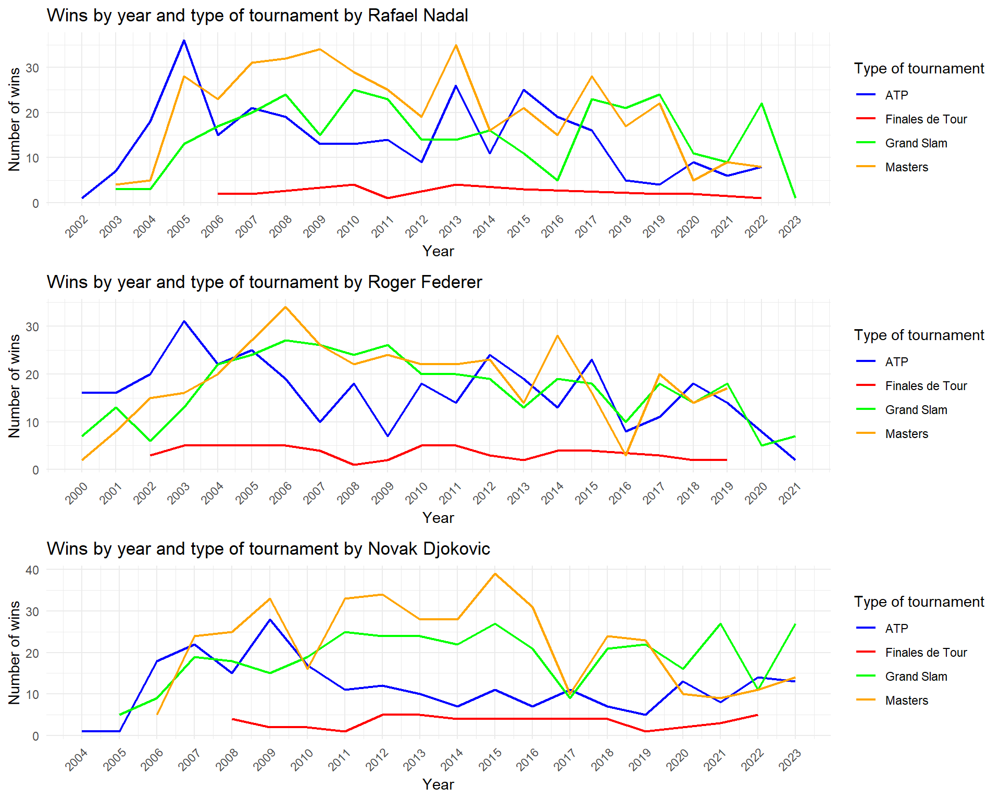

# 🎾📊 Game, Set & Data


## Overview
**Game, Set & Data** is a data science project focused on analyzing professional tennis performance using historical ATP data (2000–2023).  
The project combines **data preprocessing, exploratory data analysis (EDA), Principal Component Analysis (PCA) and clustering techniques** to extract meaningful insights about players’ styles, evolution, and performance across surfaces.

This project was developed as part of the course **Proyectos II: Data Integration and Preparation** at the **ETS de Ingeniería Informática (UPV, Valencia)**.
---

## Project Preview

<p align="center">
  
  
  
</p>


## Objectives
1. **Playing Styles**  
   Identify and classify tennis players’ styles by analyzing serve effectiveness, return efficiency, and break point stastistics using **PCA** and **clustering**.  

2. **Performance Evolution Over Time**  
   Track the progression of players and general tennis dynamics from 2000–2023.  
   - Identify emerging, consistent, and irregular players.  
   - Study how the game has changed (e.g., rise in *aces*, fewer double faults, taller players).  

3. **Surface-Specific Performance**  
   Explore how performance varies across **clay, grass, and hard courts**, identifying dominant players and key variables by surface.  
   - Supported by interactive apps built with **Shiny**.  

---

## Data Sources
All data comes from the **[Jeff Sackmann tennis_atp repository](https://github.com/JeffSackmann/tennis_atp)**, a widely recognized source for historical ATP statistics.  

### Main Datasets
- **Matches.xlsx** → Match-level data (winner & loser stats).  
- **Players.xlsx** → Aggregated statistics per player (totals, averages, percentages).  
- Additional transformations by year and surface were derived from these.  

---

## Methodology
### 1. Data Preparation  
- Transformed match data so each row corresponds to a single player (winner or loser).  
- Aggregated statistics at **player-level, year-level, and surface-level**.  
- Cleaned missing values and filtered low-relevance tournaments (e.g., Davis Cup) and rare surfaces (Carpet).  

### 2. Exploratory Data Analysis (EDA)  
- Wins by year, player, and country.  
- Distribution of aces, double faults, and serve effectiveness.  
- Surface-based performance comparisons.  

### 3. Principal Component Analysis (PCA)  
- Reduced dimensionality while preserving variance.  
- Identified outliers using **Hotelling’s T²** (e.g., Nadal, Federer, Djokovic, Alcaraz).  
- Highlighted variables with the greatest contribution (e.g., win percentage, first/second serve efficiency).  

### 4. Clustering  
- Tested multiple methods: Ward, Average Linkage, K-means, K-medoids.  
- **K-means with 3 clusters** chosen as optimal (based on silhouette scores).  
- Cluster profiles revealed **all-round players, service-dominant players, and low-performance players**.   

---

## Results
- Clear **styles of play** identified through PCA + clustering.  
- Evidence of tennis evolution (better serves, taller players, fewer break points).  
- Surface-specific dominance:  
  - **Nadal → Clay**  
  - **Federer → Grass**  
  - **Djokovic → Versatility across all surfaces**  
- Interactive **Shiny apps** for performance exploration.  

## Repository Structure

```plaintext
game-set-data/
│
├── data/               # Raw and processed datasets (CSV, XLSX, RData)
├── code/               # R scripts for preprocessing, EDA, PCA, clustering
├── docs/               # Reports, annexes, and translated documentation
├── apps/               # Shiny apps for interactive analysis
└── README.md           # Project documentation
```

---

## Lessons Learned
- Importance of **flexible objectives** when initial ones become too complex.  
- **Time planning** is critical: data cleaning and transformation take longer than expected.  
- **Visualization matters**: interactive dashboards significantly improve interpretability.  

---

## How to Run the Shiny Apps Locally

Clone this repository:

```bash
git clone https://github.com/borjarog/game-set-data.git
cd game-set-data

Open R and run the apps with:

# App 1: Player performance over time
shiny::runApp("apps/1 - Evolution Analysis - APP.R")

# App 2: Performance by surface
shiny::runApp("apps/2 - Surface Analysis - APP.R")
```

---

## Authors
- Rubén Asensi Valls  
- Pablo García Pérez  
- Borja Rodrigo Garrido  

---

## License
This project is for **academic and research purposes only**.  
Data courtesy of [Jeff Sackmann’s tennis_atp](https://github.com/JeffSackmann/tennis_atp).  
